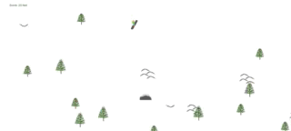

# BackCountry

## Background
This is a JavaScript based single-player game that is fully inspired by the classic SkiFree PC game created by Chris Pirih. The player is a snowboarder free riding down a mountain, and the goal is to get as far as possible without running into obstacles. If you run into too many obstacles then you better speed up because the Yeti is coming to get you!

## Functionality & MVP
 - Start and Restart game once a player loses.
 - Player can move across the window and can control speed.
 - Obstacles will be randomly rendered on screen.
 - When player hits obstacle they lose a life.

 - ### Bonus
    - Incorporate jumps and tricks
    - Make Yeti eating player animation after loss.

## Technology
  - JavaScript for game logic
  - HTML5 with Canvas
  - Webpack to bundle files

## Timeline
  - **Day 1**- Get Canvas working properly. Implement test board with movement.
  - **Day 2**- Figure out how to add sprites. Create start screen and functionality.
  - **Day 3**- Implement sprite "obstacles" and render to window.
  - **Day 4**- Implement sprite player. Create game play actions like player-obstacle crashes, jumps, tricks.
  - **Day 5**- Finish up styling and refactor if possible.

